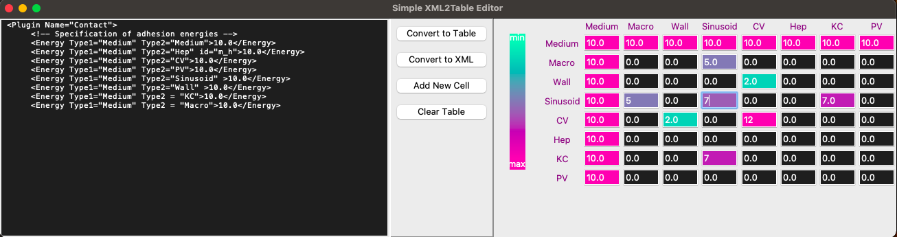

# XML2Table
A demo python GUI widget meant to facilate the parameter-settings (Contact Energies) in [CompCell3D](https://compucell3d.org/) [Git Page](https://github.com/CompuCell3D/CompuCell3D) using `TkInter`

It simply converts between the copy-pasted XML contents and a visual (upper-triangular) table. XML parsing is done using regular expressions. 

*Could be adapted for other parameter-settings in XML.*

### Required Python Packages
- Python 3.10.12 (Other python should also work)
- `TkInter`
- `Numpy`

### How to Use it
- Start the program by running 
```bash
python xml2table_v01.py
```

Either:
- Copy-paste the contact energy section/plugin from the CC3D generated XML file into the text field on the left
- Start from scratch by adding new cells

Then each button literally does what it says.

### Major Features
- The values and the background colors of symmetric entry pairs are dynamically synchronized.
- The color dynamically assigned to each entry is determined based on its relative position with respect to the min_max values imported from XML

### Example Image of the Widget



### Major Issues:                                                                                            
#### Interactive Logic
- The color dynamically assigned is still based on the initial min_max pair
- Entering a new value in an entry does not change the value stored
- Thus, entering a new value only changes the exact synced entry pair, but other entries are not updated accordingly.

**A workaround is to use the `Convert to XML` button to recollect the values altogether, then `Convert to Table` to color the entries again as a whole.**
