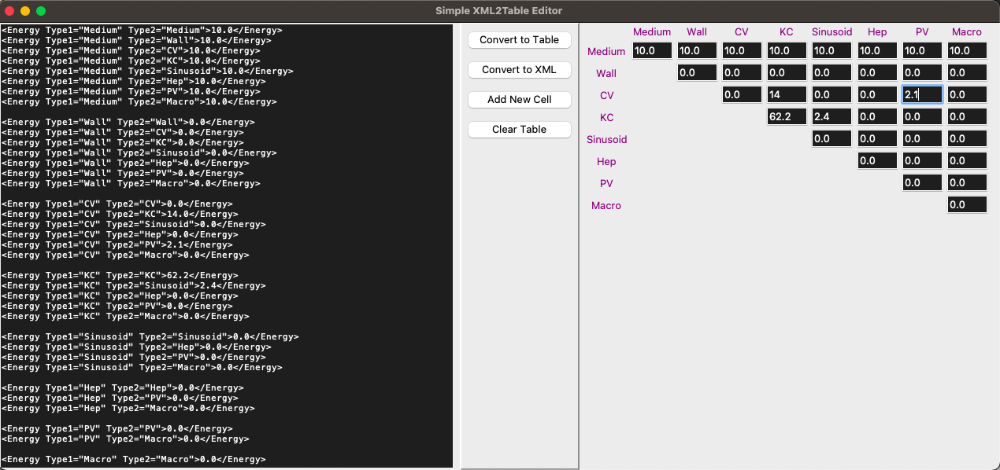

# XML2Table
A demo python GUI widget meant to facilate the parameter-settings (Contact Energies) in CompCell3D using `TkInter`

It simply converts between XML content and a visual (upper-triangular) table. XML parsing is done using regular expressions. *Could be adapted for other parameter-settings in XML.*

### Required Python Packages
- `TkInter`
- `Numpy`

### Example Image of the Interface

