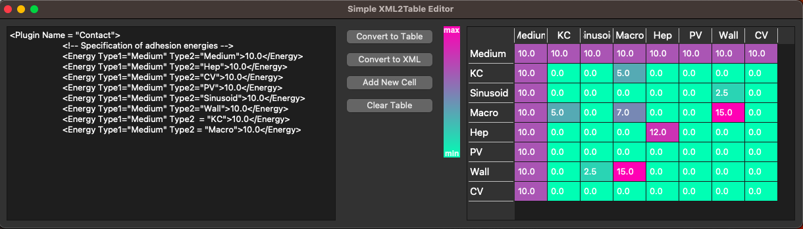

# XML2Table (PyQt5 Version)
A demo python GUI widget meant to facilate the parameter-settings (Contact Energies) in [CompCell3D](https://compucell3d.org/) [Git Page](https://github.com/CompuCell3D/CompuCell3D) using `PyQt5`

It simply converts between the copy-pasted XML contents and a visual table. XML parsing is done using regular expressions. 

*Could be adapted for other parameter-settings in XML.*

### Required Python Packages
- Python 3.10.12 
- `Numpy`
- `PyQt`

<!---
### Install
- `conda` (currently only support python>=3.8)
```bash
conda install -c xemin0 xml2table
```
- Directly clone the repo
```bash
git clone https://github.com/Xemin0/XML2Table
```


### How to Use it
#### Installed from `conda`
simply run `xml2table` from command line

#### Cloned from Github 
Navigate to `xml2table/` folder then start the program by running 
```bash
python xml2table.py
```
-->

Either:
- Copy-paste the contact energy section/plugin from the CC3D generated XML file into the text field on the left
- Start from scratch by adding new cells

Then each button literally does what it says.

### Major Features
- The values and the background colors of symmetric entry pairs are dynamically synchronized.
- The whole table's colors are updated for each change in any entry value
- The color dynamically assigned to each entry is determined based on its relative position with respect to the min_max values of the current table

### Example Image of the Widget


### Major Issues:
- `xml_parser` does not do format or syntax checks (always assumes the input from usr is correct)
- `xml_parser` does not check the parameters' type in CC3D (e.g. Contact Energy, etc)
- `conda` recipe, workflow updated but not tested yet for the PyQt version
- Static size and rendering of ColorBar
- Minimum sizes for various components
- ~XML parsing method does not preseve the ordering of cell types appeared~
- The colors are not equally spaced (as in the color bar)


### License
[BSD-3-Clause License](./LICENSE)
